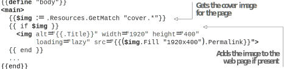
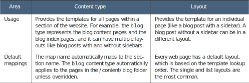
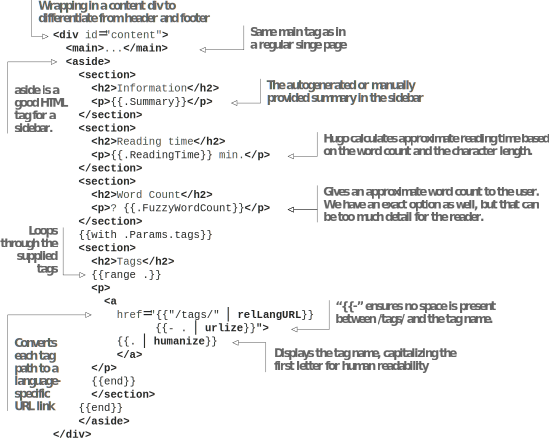
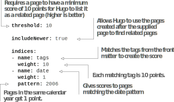
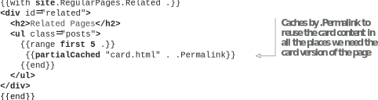

# 7.1 More ways to layout content

There are multiple types of pages in an application, each with a different look. A blog page, for example, typically has a sidebar with additional information about the blog post. Various types of pages can have different CSS styles and different HTML structures to accommodate their unique design.
One way to style pages differently, which we used in chapter 6, is to use a new content type for each category of page created. While content types are potent concepts that provide a mechanism to isolate the rendering code for a particular type of content, there are additional ways in Hugo to render content in a different design—parameterized front matter or a new layout. All three approaches have their use cases, advantages, and disadvantages, and we can use all of them in tandem in the same website.
For the Acme Corporation website, the web page design we used for the Terms of Use page (section 6.1.4) is pretty barebones. It does not work well with the content pages in the blog and the news sections. We need a more elaborate design for these pages. The desired changes in the News page can be achieved by CSS, while for the Blog pages, we want to add a sidebar, which involves adding HTML content. Let’s see the various ways in which we can achieve this with Hugo.

## 7.1.1 Parameterizing front matter to differentiate the News page interface
When we have minor HTML changes between two different types of pages, we might not want to create a new content type. We can expose a variable that the template code can use to provide differentiated HTML. Using the conditional statements if and else, we can write different HTML content if needed. This way, minor HTML changes live in the same file, and we do not need to manage a separate file on disk. We can have maximum code reuse, and we do not need to split the code into partials to prevent repetition.
For the News pages on the Acme Corporation website, we do not need many changes. These pages come with cover images that we need to apply. Remember from chapter 6, the .Resources in the context of a page refers to the resources in the page bundle for that page. We can use a with or an if check to ensure that if the resources are not present, no additional HTML is generated. We can then add this to the existing single.html as in the following listing.


    


The pages in the news section (figure 7.2) in the Acme Corporation website have a similar HTML structure to the pages we have developed so far, and all the changes live in the CSS styling. Because the HTML is mostly the same, a conditional statement approach to switch CSS classes is better suited for this use case. Although we can take the class name from the front matter as a variable and use that by calling the $.Param function, there are ways with which we could get this information without needing to write anything in the content area of the website. Had we not set up the content type, we could have used the content type for this case via the .Type property.



We can use the folder location of the page to find its section. If we run {{path.Base (path.Dir .Page.FirstSection.File.Path)}} for the News page, we will get the news section. .Page.FirstSection points to the _index page of the news section, and we can find the folder name using the path.Dir at its path. Note that we can also use CurrentSection for the News page, but this will break the community subsection of the blog section. We can use this folder location to change the HTML class of  the  News page and make it different from the other pages as in listing 7.2.


**TIP** Minimizing the need for entering data in the front matter can help keep the content area simple. When creating content, the less we have to think about front matter metadata, the better. We make a theme once, but we continuously add content to the website.



```
{{define "bodyClass"}}
{{ path.Dir .Page.FirstSection.File.Path) }} page
{{end}}
```



**TIP** It is good to expose one entry in the head section of the website in the define block. This can be overridden for page-specific metadata or for supplying page-specific CSS/JavaScript files, making the theme extensible. We could even have a naming convention like cover.* to load additional CSS/JS files.


The single page template can automatically find the section’s name and provide the appropriate CSS class with these changes. Because this code is present in the single page template for the modern type in Hugo, we need to assign all pages in the news section to this content type. We will need to add type: modern to every page in the news section. Considering there could be hundreds of News pages, that is a lot of   work. For new pages, however, archetypes (discussed in section 5.4.3) can help in predefining them, but the text will still be required, leading to the possibility of typographical errors and other mistakes.

## 7.1.2 Using the cascade property to apply properties to the front matter of multiple pages

One central principle in Hugo is to reduce work and prevent duplication of the code to the maximum extent possible. Having a property shared between all pages in a section is common for websites. Hugo recognizes this and provides a mechanism to write this property once and apply it to all of the pages. Hugo has a property in the front matter called cascade (figure 7.3), whose subproperties apply as front matter properties to all pages in that section.

{{< figure src="Figure7.3.svg" title="Figure 7.3 The cascade property allows us to provide values to the front matter variables, which we can use across the whole section. In the diagram, local specifies the keys in the front matter, while cascade sets the same key as a subkey for the cascade. The top-level _index file specifies a cascade that applies to that file as well as to the subsections for its child pages. /C issues a cascade override so that its subtree gets the cascade value from this section. /C2 does not use an override, and therefore, the cascade from /C carries through. In /C2b, we have a local override that takes over the property. In /D, we do not override the cascade property, but /D2 does a local override. /E has both a local override for the specific index page and a cascade for the child pages, which /E1 uses. Section /F only has a local override, and the properties from its root follow through to /F1." >}}

The concept of cascade is the same as in CSS, which stands for cascading style sheets. We define a generic property at the top level and then a specific property when an override is needed. The more specific property overrides the generic one. We can even do a local override, where the cascade property applies to the subpage but not to the current page because the property present in the front matter for the current page has a higher priority.

On the _index page for the news section, let’s enable the type modern via the cascade property as in listing 7.3. We will revert it for the news/_index page because the modern type does not have the HTML layout for a branch list page. By default, the cascade property applies to all pages in a section, including subsection index pages (list.html) and individual (single.html) pages.


```markdown
cascade:  type: 
  modern
type: _default
```



**NOTE**  We could have used a garbage string in the front matter’s root level  type field. Hugo falls back to the _default folder to look for the layout if the type specified in the front matter is not present on the disk.



**CODE CHECKPOINT** https://chapter-07-01.hugoinaction.com, and source code: https://github.com/hugoinaction/hugoinaction/tree/chapter-07-01.


Every page in the news section has been assigned to the content type modern using the cascade property. Once this is enabled, we can see the child pages in the news section render with the new CSS styling for the News pages. The next set of pages that need a different design are the Blog pages.


**NOTE** We can still override the cascade property by manually specifying it in the front matter; for example, if we put type: _default in any of the pages in the news section, that specific page renders with the default content type even if it is in the news section that has set the cascading content type modern. We can view the various permutations of cascade and overrides in figure 7.3.


## 7.1.3 Providing a different layout to the blog content

The design for the blog section includes a sidebar (figure 7.4). Over time, we expect blogs to diverge in design from the News pages or the regular web pages. Keeping the code together with unrelated pages is not a scalable solution. When we have more than a couple of conditional statements, things can get complicated, especially if the content in these conditional statements is enormous. If we want to share the base template with different generated HTML for various content, we need to create a new layout.



The default layout for a web page/leaf bundle is the single layout, so we have a file called single.html. This is where we provide the overrides to the base template. But we are not restricted to that layout. We can override it to anything we desire. Layouts within a content type share all templates within the content type including render hooks. Table 7.1 compares the content type with a layout.

Table 7.1 Content type vs. layout


We want to have a sidebar in the blog section to provide more information about the blog post. We can provide information like tags in the front matter and things like summaries used in the index page and other properties in the front matter. Along with this, Hugo can generate a bunch of other metadata such as an approximate reading time with the .ReadingTime property and an approximate word count with the .WordCount property.

Let’s  create  a  new  file  called  blog.html  in  the  modern  folder  (https://github.com/hugoinaction/hugoinaction/tree/chapter-07-resources/01). In this file, we will define the body block for the Blog pages to include a sidebar. The following listing sets up a sidebar in the HTML <aside> tag that provides information generated by Hugo.



   	

We will also need to specify the layout and type for the blog section via the cascade property as in the following listing. We use this to update the layout and content type   in the blog section.


---
cascade: layout: blog type: modern
---


We have now updated all the pages in the blog folder from the single layout to the blog layout.


**Exercise 7.1**
A _______ in Hugo can share the base template and Markdown render hooks (mentioned in section 6.4) with other templates of the same content type.


## 7.1.4 Cascading targets

We also have an index page for the community subsection of the blog section. Like the News pages, we do not want the new template to override the index page for the blog section. One approach to prevent this override is to add a local override in _index.md in both of these places. However, this approach can lead to bugs when we introduce new sections and forget to apply this setting. A better solution is to scope the overwrite to the right set of pages. To do this, along with the cascades, we can provide target information in the front matter using the key _target. We can use this key to restrict the cascade option to only apply to a subpath, a specific language folder, or a specific kind of page in Hugo. To restrict the target to the non-index pages, we need to understand the concept of page kinds in Hugo.

### PAGE KINDS IN HUGO

Similar to a layout, each page in Hugo has a kind. A kind is the internal data structure that represents a page in Hugo. The set of variables available to the template are dependent on the kind of page. For example, the taxonomy page kind always has access to the list of terms in the taxonomy, which may not be available in the other page kinds. The kind of a page cannot be changed. In Hugo, the page kind is one of the following:
home—The index page of the entire website. Corresponds to index.html by default.
- page —A single web page. Corresponds to single.html by default.
- section —The index page of a website section or branch bundle. Corresponds to list.html by default (see section 7.2).
- taxonomy —The index page of an individual taxonomy list. Corresponds to terms.html (and not to taxonomy.html) by default (see section 7.3).
- term—The page for an individual taxonomy term. Corresponds to taxonomy.html (and not to terms.html) by default (see section 7.3).


**Difference between theme, type, layout, and page kind**

While they may seem synonymous, the theme, type, layout, and page kind are different things in Hugo:

- A theme represents the templates for the entire website. It contains multiple types.
- A type (or content type) represents a section of the website that can have multiple variations of content and multiple templates for generating the HTML for each of the variations. A type can have many layouts.
- A layout maps to a single template that can render a single design across multiple pages. Using conditionals, we can make some content different, but there has to be one template that represents a layout.
- A page kind in Hugo defines what variables are available to the template when it is rendered. A page kind is fixed and cannot be changed.


### APPLYING CASCADE ON A PAGE KIND

Our template only targets the single pages, all of a kind page. We can override  the  type and layout for these pages by selecting them as the target in Hugo. The following listing shows this for individual pages in the blog section. With these changes, the blog and the community index pages should revert to normal, while the rest of the pages in the blog section will have a sidebar.


---
cascade:
- _target:
  kind: page layout: blog type: modern
---



**CODE CHECKPOINT**    https://chapter-07-02.hugoinaction.com, and source code: https://github.com/hugoinaction/hugoinaction/tree/chapter-07-02.


## 7.1.5 Related pages via Hugo

In the blog section, we will like to introduce a link to more pages, relevant to the reader within the website. Related pages is a Hugo feature that allows us to get pages similar to the supplied page. The related pages feature encapsulates the matching algorithm for pages to achieve this complex operation, and it comes with an outstanding performance. The similarity matching is done based on the metadata, and the front matter parameters are controlled using the related section in the website configuration. A file named  related.yaml  (https://github.com/hugoinaction/hugoinaction/tree/chapter-07-resources/02) can be placed in the config folder to control how the pages are selected. The following listing shows how to use parameters to find the related pages for a given page.





Note that when providing a threshold to get a list of related pages, it needs to be a number between 0 and 100. When searching for related pages, the includeNewer parameter can cause the list of related pages to change as we add more content.

The site.RegularPages.Related function takes a page as an argument and provides scores to all pages in the website related to that page and then sorts those pages. Because Hugo provides no limits, this can turn into a vast list, and therefore, it is a good idea to filter out the top few pages to show to the end user (for example, with first 5 in the code).

The card view of the page is the same as what we used on the home page for recent blog posts (see figure 5.8). We can move it to a partial. To do that, we can use a cached partial (as discussed in chapter 6) because the rendition of a page is the same across all pages. The following listing uses site.RegularPages.Related to find related pages and then uses a cached partial, card.html, to render those within the current page.



  	


**CODE CHECKPOINT**    https://chapter-07-03.hugoinaction.com, and source code: https://github.com/hugoinaction/hugoinaction/tree/chapter-07-03.



**Exercise 7.2**

Which property decides the contents and availability of variables in Hugo?
- a. Type
- b. Layout
- c. Kind
- d. Content type
- e. Template name
- f. Permalink
- g. Containing folder
