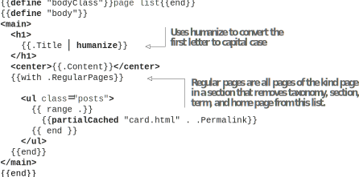
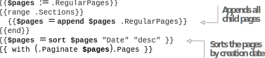
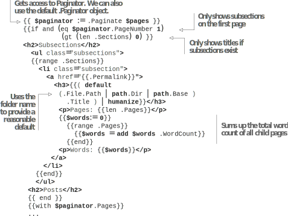

# 7.2 Updating the index pages by providing content and subsection lists

The index pages like /blog need to have a different interface than the regular pages. Rendering it with the blog layout renders only the Markdown content, and we lose the capability to navigate to the child pages in the section and the subsections. These pages deserve separate templates.

## 7.2.1 Using the list template for index pages

The index pages provide access to the content within a section. Because we have multiple content pages, the index pages have a list of pages. These are called list pages. Hugo allows list pages to have a different template to render content differently.

Let’s create a file called list.html in the modern subfolder in the layouts directory.  In the index page, we need to provide a list of pages in the section. If a page has child pages, those are available in the .RegularPages variable for the page. We can loop through  these  pages  to  provide  a  list  of  child  pages  for  navigation  (https://github.com/hugoinaction/hugoinaction/tree/chapter-07-resources/03). The following listing shows how to provide the list of pages for the Acme Corporation website.



    

In blog/_index.md, we can return the modern content type for all the pages where the kind is section. The following listing sets up these pages as the list type for the Blog pages. The blog index page will then render with the list of pages directly in that section with these changes.


```markdown
---
cascade:
    - _target:
        kind: section 
        type: modern 
        layout: list
---
```



**CODE CHECKPOINT**    https://chapter-07-04.hugoinaction.com, and source code: https://github.com/hugoinaction/hugoinaction/tree/chapter-07-04.


## 7.2.2 Creating multiple pages to render a long list

We loop through all the pages in a section to form the index page. One problem with this approach is that all pages will render together on a single page even if we have hundreds of posts. That would turn this into a heavy web page and cause a slow down when loading. But if we restrict to a smaller number of posts (like we did on the index page using the first function), all the posts will not be navigable. We need a mechanism to provide multiple pages with all the posts generated from one template (figure 7.5). Hugo answers this problem with the Paginator object.



Paginator is a Hugo object used to create multiple pages from a single function call. We can use .Paginator.Pages in the loop instead of .RegularPages as in the following listing and set the pagination options in the website configuration file. The .Paginator object automatically splits the list of pages into multiple pages and supplies the right set of pages to render.


```html
{{ with .Paginator.Pages }}
<ul class="posts">
```


Because we have a small number of posts, we need to change the number of posts per index page to trigger pagination. The following listing changes the number of elements in a page in config.yaml for the paginator to take effect.



    


**Grouping pages**

Hugo supports grouping pages into arbitrary groups using the .Pages.GroupBy set of methods. For example, if we want to show pages with headings based on the creation year, we could use the {{range .Pages.GroupByDate "2006"}} and then set the year as the .Key and .Pages as all pages with that key. This sample code is not added to the chapter resources, but you can add it to layouts/modern/list.html.

```html
{{ range .Pages.GroupByDate "2006" }} Posts in year {{ .Key }}:
{{range .Pages}}
<a href="{{.Permalink}}"> {{.Title}}</a>
{{end}}
{{end}}
```


The snippet groups all pages by year. Then it loops through the various years, providing them in the .Key field with the pages belonging to the year in the .Pages field. We can also use the Paginator object for page groups.

To enable page numbers, we can use the properties from the .Paginator object (for example, TotalPages, Next, First, PageNumber, and so on). Hugo ships with an internal template that we can also use for this task. The following listing enables the internal template, which is mostly complete and rarely overridden by themes.


```html
{{ template "_internal/pagination.html" . }}
```


While the default pagination template is good, the terse pagination template (listing 7.14) builds faster and, therefore, is recommended. A copy of the template is present in the chapter resources just in case it gets modified in future versions of Hugo (https://github.com/hugoinaction/hugoinaction/tree/chapter-07-resources/04).


```html
{{ template "_internal/pagination.html" (dict "page" . "format" "terse") }}
```


We can now update the news index page to use the modern content type. The pagination does not show up in the news section because it has just one page.


**CODE CHECKPOINT**    https://chapter-07-05.hugoinaction.com, and source code: https://github.com/hugoinaction/hugoinaction/tree/chapter-07-05.



**Exercise 7.3**

What allows us to split a single array across multiple pages in Hugo?
- a. List template
- b. Bundle
- c. Cascade
- d. Content type
- e. Paginator
- f. Taxonomy


## 7.2.3 Using a custom paginator

The built-in .Paginator has a great set of defaults and, in most cases, suffices for the index page. We can further customize that page if needed. The community blog posts hidden away in a subsection on the Acme Corporation website do not get too many hits. Therefore, the management wants to uplevel them to the regular blog list. The default pagination does not include all child pages but only direct descendants. We need to use a custom paginator to use both the section and subsection pages as in the following listing. For this, the .Paginate function takes a list of pages.



    

This code reads the pages from the one-level deeper subsections and appends them to the $pages variable. If we need navigation for the entire tree, we need to write a recursive partial template. When we create a custom paginator, Hugo does not generate the default paginator.


**NOTE** We can override the page size specified in the configuration using the Paginate property by passing it as an additional argument to the .Paginate function. For example, .Paginate $posts 5 puts 5 posts in one page.


## 7.2.4Rendering a list of subsections

The community blogs are a subsection of the blog section of the website. Each index page has a variable called .Sections, which gets a list of the child sections for index pages. Using this variable allows us to show the child pages for each section with the current page. Without providing a list of subsections on the list pages, we leave pages like these unreachable. In this section, we will also add a list of subsections to the first of the section pages (figure 7.6).



We can use the Paginator object to detect if this is the first page (https:// github.com/hugoinaction/hugoinaction/tree/chapter-07-resources/05).  If  the  user is on page 1, we can display the header for posts (versus subsections) and the list of subsections. The following listing uses .Sections in the index page of a section to provide the subsections in a Hugo template.



    


**CODE CHECKPOINT**    https://chapter-07-06.hugoinaction.com, and source code: https://github.com/hugoinaction/hugoinaction/tree/chapter-07-06.


Something to note here is that if we have multiple subsections, we will not be able to have multiple paginators (one for pages and another for subsections). A page can have only one paginator. This limitation is present because if we have two paginations per page (for example, subsections and posts), we will need to support independent navigation (for example, post page 2 with subsection page 1, post page 3 with subsection page 1, post page 2 with subsection page 2, post page 3 with subsection page 2, and so on). Double pagination has exponential (O(nk)) combinations (to n paginations and k pages each), which is slow and wasteful.


**CODE CHECKPOINT**    https://chapter-07-07.hugoinaction.com, and source code: https://github.com/hugoinaction/hugoinaction/tree/chapter-07-07.
