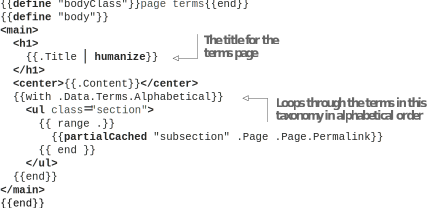

# 7.3 Providing the taxonomy pages

There are two types of taxonomy pages: the taxonomy page (used for each taxonomy term) and the terms page (used for the taxonomy list). The terms pages provide a list of all the terms in the taxonomy (for example, all the tags at /tags), while the taxonomy pages list all pages with a specific term (like all posts with the tag square). Before overriding any of the pages, let’s see how they look in the existing list template. Let’s replace the type as a cascading property in content/categories/_index with modern and see how the pages look. The terms in a category turned into child pages for the category, while the individual posts became the child pages of each taxonomy page.

Hugo tries to ease the life of theme authors by fitting various content into the two types of pages: list page and single page. The index page, the terms page, and the taxonomy page fall back to the list page if the corresponding pages are not present (the single template is for individual pages). We can override these pages by creating a taxonomy.html and terms.html layout for the taxonomy page and a list of terms, respectively. Because the list template does not read taxonomy terms, locations like /categories will not show any content yet.


**NOTE** A Hugo website needs only two templates: a list.html and a single.html to be complete. Remember from chapter 4, there are two types of bundles in Hugo: branch bundles and page bundles. The two templates, list.html and single.html, correspond to these bundle types, respectively. All other templates are specialized cases of the list template. If we remove index.html, Hugo selects the list.html for the website’s index page. Similarly, the taxonomy pages use the list template to render unless we provide a custom template.



**CODE CHECKPOINT**    https://chapter-07-08.hugoinaction.com, and source code: https://github.com/hugoinaction/hugoinaction/tree/chapter-07-08.


## 7.3.1 The terms page

The terms page shows a list of terms in a taxonomy. We can define pages for individual terms and have content associated with them to provide summaries. It is rather rare that we need such a thing. We rarely write the summary for each hashtag that we use in the website. A better presentation would be to provide a list of tags (figure 7.7).



In layouts/modern/terms.html, we will provide the same minimal details that we used for the subsections that we will be moving to a partial (https://github.com/hugoinaction/hugoinaction/tree/chapter-07-resources/06). Note that because not all taxonomies have a file, we need to wrap the h3 in if checks in the partial. The .Data.Terms variable allows access to all the terms in the given taxonomy type. We have many
options to get sorted versions of this data. Alphabetically, the one we will use in the following listing is the most popular.





Note that, in the previous listing, the title for the terms page comes from the website configuration (for example, categories) but can be overridden by creating a separate
_index.md for the taxonomy list (for example, content/categories/_index.md). The next listing provides the subsection partial that is used to render a subsection as a card. Individual terms within a taxonomy list are rendered as a subsection.


```html
<li class="subsection">
<a href="{{.Permalink}}">
{{if .Title}}
<h3> {{.Title | humanize}} </h3>
{{else if .File}}
<h3>{{.File.Path | path.Dir | path.Base | humanize}}</h3>
{{end}}
<p>Pages: {{len .Pages}}</p>
{{$words:= 0}}
{{range .Pages}}
{{$words = add $words .WordCount}}
{{end}}
<p>Words: {{$words}}</p>
</a>
</li>
```



**CODE CHECKPOINT**    https://chapter-07-09.hugoinaction.com, and source code: https://github.com/hugoinaction/hugoinaction/tree/chapter-07-09.


## 7.3.2 The taxonomy pages

Most developers do not need to override the taxonomy pages because the list template works well for these pages. The list pages are so good that a great start to customizing the taxonomy pages is to take the list template and create a copy called taxonomy.html. Now we can customize the taxonomy.html template. The section associated with the taxonomy page is the terms page and has all the variables associated with terms.html accessible. We can use this to change the title of the taxonomy page as the following listing shows.


```html
<h1>
{{$.CurrentSection.Data.Singular | humanize}}
- {{.Title | humanize}}
</h1>
```



**CODE CHECKPOINT**    https://chapter-07-10.hugoinaction.com, and source code: https://github.com/hugoinaction/hugoinaction/tree/chapter-07-10.



**NOTE** Remember, in chapter 4, we provided both the singular and plural text  for a taxonomy. Hugo allows access to both the strings for our use. It does not automatically convert those because that cannot be reliably done across languages (not programming but human languages) without a vast database. We can use any of the strings as we see fit in the template.



**Exercise 7.4**

The two most important templates in Hugo’s template system that can be mapped to all other templates in a meaningful way include (select two):
- a. list.html
- b. baseof.html
- c. terms.html
- d. taxonomy.html
- e. single.html
- f. index.html
- g. hugo.html
- h. partial.html
