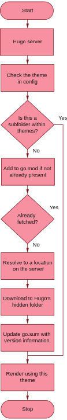

# 8.3 Importing themes

Once we have enabled Hugo Modules, we can come back to config.yaml to manage it. If the theme is available as a Git repository on GitHub (as is the case with most Hugo themes), Hugo can do the job of fetching and set- ting it up for us automatically. We will be testing the waters by first import- ing Eclectic via Hugo Modules and then move to AcmeTheme after that. Unlike downloading the theme manually from GitHub and placing it in the themes folder, we can put github.com/hugoinaction/Eclectic in the theme configuration setting as listing 8.2 shows, and Hugo will do the downloading for us.


**NOTE** If you are working offline, read along to section 8.7, where we get back to using the theme locally, discussing how we can achieve that for other dependencies.



```
theme: github.com/hugoinaction/Eclectic
```


That’s it. The next time we run hugo server or push to GitHub pages or to Netlify, Hugo automatically fetches the Eclectic theme from the internet and uses that to render our website. When we run hugo  server after linking to a GitHub repository, many things happen (see figure 8.3):
- In the background, Hugo figures out and installs the correct ver- sion of the dependency. Hugo also caches this locally for subse- quent runs.
- The go.mod file is updated with the direct list of dependencies on the website.
- A new file called go.sum is created, ensuring that Hugo will fetch the correct version of the dependency specified in the go.mod file. Like Gemfile.lock in Ruby and package-lock.json in the Node.js world, this file ensures consistency and reproducibility of the build by listing exact versions of all direct and indirect dependencies.



Figure 8.3 Activities happening at launch when we load the Hugo development server with a Hugo Modules-based theme

You can push the AcmeTheme folder to a new GitHub repository and use that as the location to load the theme. You do not need to initialize the AcmeTheme repository as a new Hugo module or add any code to use it. If you specify a dependency as a theme in the configuration file, config/_default/config.yaml, there is nothing else that Hugo needs. A theme can have a go.mod file to specify its dependencies, but it is not required. Hugo will honor it if such a file exists. Hugo will read the theme if no such file exists.


**CODE CHECKPOINT**    https://chapter-08-01.hugoinaction.com, and source code: https://github.com/hugoinaction/hugoinaction/tree/chapter-08-01.
