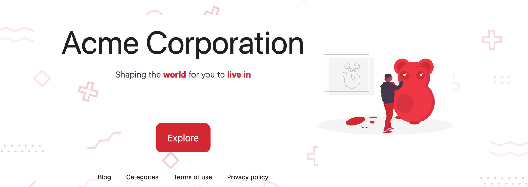

# 8.8 Adding nested dependencies

With Hugo Modules so far, we have been able to load the theme dynamically and provide some level of checks (like the minimum Hugo version needed) for the theme to be used correctly. The main power of Hugo Modules is the ability for the theme to have its own dependencies, which we will use now. Because turning a theme into a Hugo module makes it possible for theme-specific dependencies, these will be pulled into the website when installing the theme. In Hugo, we can have various module dependencies from templates and content to JavaScript and CSS.

We can mount dependencies from any folder in a dependency to any location in our website. Hugo Modules coupled with Hugo Pipes can act as a lightweight bundler for linking to and bringing in resources (for example, themes, layouts, assets, content) for our website as an alternative to the npm plus webpack ecosystem in JavaScript or to RubyGems Sprockets in Ruby/Rails. Unlike asset systems that force content to mount to a specific folder (for example, node_modules in JavaScript), Hugo Modules can map to anywhere in its filesystem. We can import the asset template files (*.css.tpl) into the assets folder to use them on the website.

Additional support files are present in the github.com/hugoinaction/AcmeSupport repository, so we will import those via Hugo Modules. For offline usage, the chapter resources for chapter 8 also contain the contents of this repository that we can import using the replace directive previously described (https://github.com/hugoinaction/ hugoinaction/tree/chapter-08-resources/02).

First, we need to add a dependency to the AcmeSupport repository. By default, Hugo imports all dependencies into the themes folder. Because themes are the most common dependency, this default allows us to import a theme by specifying a GitHub location as described in section 8.3.

Hugo mounts all modules in the /themes folder by default. The AcmeSupport repository consists of CSS template files. Therefore, we need to manually override the default location where this dependency is mounted. Hugo allows us to specify mount points in the source as well as the target repository.

The AcmeSupport repository is not a Hugo module; there is no go.mod file in it. Still, we can import it successfully. To specify its mount points, we can go in to the configuration of the integrating repository (the AcmeTheme codebase) and specify the mount points in the module section as the following listing shows. We will mount the assets folder (the source name can be anything) to the assets folder (the destination name, needs to be assets) in the theme repository.


```yaml
module:
...
  imports:
    path: github.com/hugoinaction/AcmeSupport
    mounts:
      - source: assets
        target: assets
```



**CODE CHECKPOINT**    https://chapter-08-06.hugoinaction.com, and source code: https://github.com/hugoinaction/hugoinaction/tree/chapter-08-06.


If you remember from chapter 6, we used Hugo Pipes to merge the *.css.tpl file into the CSS file used in the website. The newly added css.tpl files are automatically included with the changes we previously made and are used on the website. This CSS file (added in the AcmeSupport repository) reverses the order of the image and the text on the home page as shown in figure 8.4. The image goes to the right and the content to the left. We can use this to verify that the module is loading as expected.



Figure 8.3 Swapped image and content on the home page with AcmeSupport

If we run hugo mod vendor at the root (the Acme Corporation repository), Hugo creates the AcmeSupport folder in the _vendor/github.com/hugoinaction folder, which now contains the contents of the Git repository. Hugo also updates the go.sum file for the Acme Corporation website with this dependency. The go.sum file tracks dependencies as well as subdependencies used in the project. If we want to audit the dependencies of a website, the go.sum file is the right place to look.


**Exercise 8.2**

What information is present in the go.mod file? (Select all that apply.)
- a. Name of the module
- b. Version of Hugo used to create the module
- c. List of dependencies (both direct and indirect) of the website
- d. Exact hashes of each website dependency
- e. Mount paths for various folders in the repository


We can mount as many subfolders as we desire because the mounts option in the configuration file takes a list of source and target mount locations. This option allows us to import our JavaScript and CSS dependencies without needing the originating repositories to be set up as Hugo Modules or to even understand Hugo as a concept, which opens up the entire internet as a source of content for a Hugo website. Popular

JavaScript/CSS libraries like Bootstrap (https://getbootstrap.com), jQuery (https:// jquery.com), etc., can be linked via this method. We could also link icon packs like FontAwesome  (https://fontawesome.com)  or  SCSS  toolkits  like  Bourbon  (https:// www.bourbon.io).


**NOTE** Even if you plan to use the theme for a single website, using Hugo Modules provides the ability to link to dependencies outside of the theme. Linking through modules instead of copying offers the benefit of updating the dependency quickly and tracking the ownership of pieces of code better. We can also have subdependencies, which makes this very flexible.
