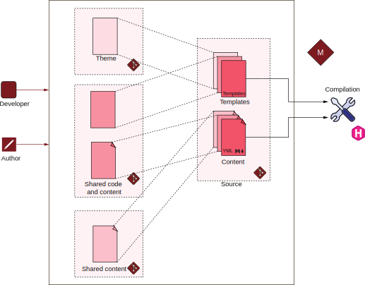
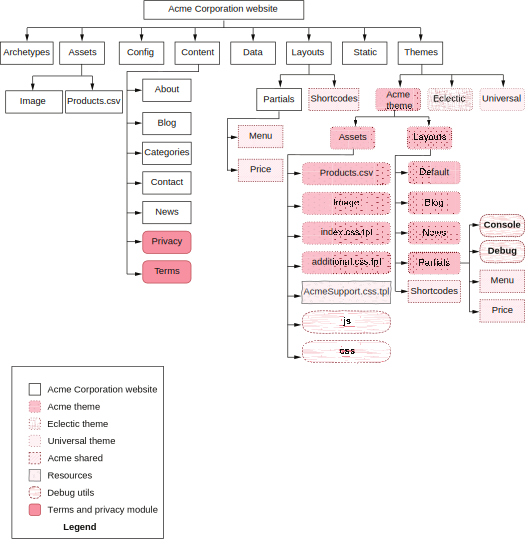

# 8 Hugo Modules: Plugins for everybody


**This chapter covers**
- Using Hugo Modules for distributing and using themes
- Adding dependencies in a theme or a website with Hugo Modules
- Embedding template plugins to get reusable Go template code
- Including plugins that provide configurable content

 
In this chapter, we will set up and utilize Hugo Modules—one of the most powerful, underrated, and underutilized features of Hugo. We have worked in isolation so far and have an independent website with no external dependency. That’s an incredible feat to have in modern-day software. Lots of poorly maintained dependencies make managing software difficult. That does not mean that we should always build our website as a monolith. There are immense advantages of splitting our site into modules that can work independently. We can then reuse the theme across multiple sites. Shortcodes, debugging utilities, and certain types of content can have a life of their own.

The desire to have a low number of dependencies should not be a goal in itself. Some dependencies provide so much that it would be foolish not to use them. If we write the same code that we would have gotten by adding a dependency, it might be a waste of effort. Our custom utilities might fall short both in features and maintainability rather than well-architected and maintained external libraries. There is a tradeoff between doing it yourself versus importing third-party code. Suppose we want to split our code into modules for reuse across multiple websites or have dependencies external to our custom code that’s created and managed by someone else. In  that  case,  Hugo provides the means to manage this effectively via Hugo Modules.

Hugo Modules have been integrated tightly into Hugo, and all Hugo features are tuned to work better with Hugo Modules. With Hugo Modules, we can manage the versions of our theme better. We can move our shortcodes out for use across multiple websites, or we can pick up some built by the community to drop into our website. We may need some content across numerous websites, but copy and pasting across projects becomes a nightmare when the need to update it arises. Although, logically, Hugo creates one folder with everything needed to set up a website that is provided in the template code, physically, the files could be re-sent across various repositories that Hugo assembles for us to use (see figure 8.1).

Figure 8.1 In this chapter, we separate our code into modules used by Hugo to create a logical structure with co-located files for our template code to use. In contrast, physically, this code may be present in independent repositories.

In this chapter, we will utilize Hugo Modules to import themes to our website. Hugo Modules are the parts of a Hugo website (including any of the folders) that are available as a reusable component. We will move AcmeTheme into a module that we can reuse across multiple websites. We will add the ability to load CSS and JS files dynamically through sources not set up as Hugo Modules. We will also include debugging utilities as an external Hugo Module and showcase how we can externalize website content by moving our Terms of Use and Privacy Policy pages to an external module that can reuse the base content of these pages across multiple websites. Figure 8.2 provides the structure of our website when we reach the end of this chapter.

Figure 8.2 Modular structure of the Acme Corporation website that we will set up in this chapter. The Acme Corporation website will include multiple modules: AcmeTheme/Eclectic/Universal as themes; AcmeCommon for shortcodes and partials shared between the AcmeTheme and the Acme Corporation website;
AcmeSupport for assets that we need to progress through in this book; hugo-debug-utils with the debug bar; and the TermsAndPrivacy module, where the content files shared
between multiple websites are present. Note that this figure does not include all files, just a representative list to understand the actual filesystem used when including the modules for rendering.